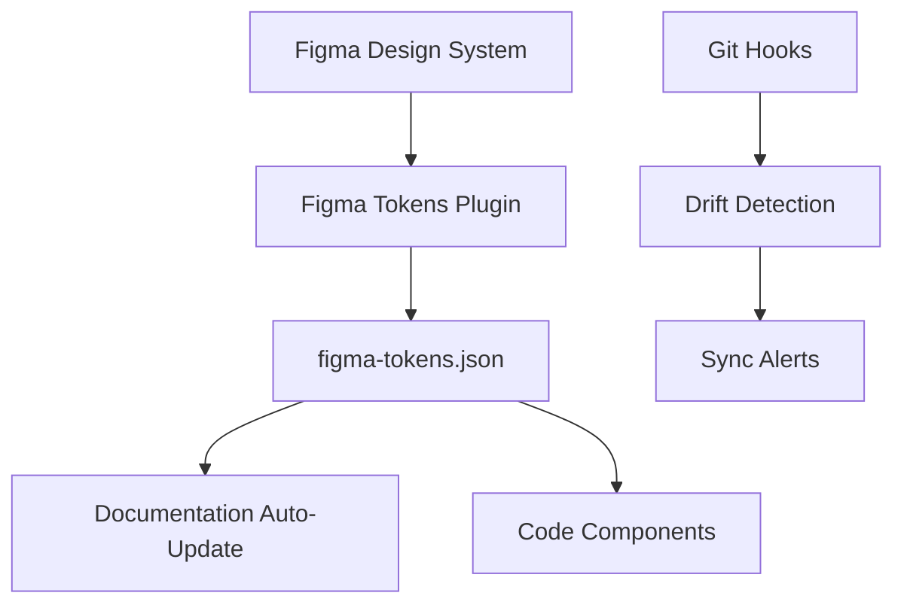

# 🔄 Token Sync Workflow

## 🎯 **Architecture Overview**



## 📋 **Single Source of Truth: Figma**

**Figma** is the primary source for design tokens. All changes should start there.

## 🚀 **Daily Workflow**

### **When Changing Tokens in Figma:**

1. **Design in Figma** 
   - Modify spacing, colors, border radius, etc.

2. **Export & Sync**
   ```bash
   # Method 1: Figma Tokens Plugin (Recommended)
   # Export from Figma → Replace figma-tokens.json → Done!
   
   # Method 2: Automated (if API setup)
   npm run tokens:sync
   ```

3. **Verify Changes**
   ```bash
   npm run tokens:validate
   ```

### **When Changing Code:**

```bash
# Extract tokens from code changes
npm run extract-tokens

# Check for drift
npm run tokens:check-drift
```

## 🔧 **Available Commands**

| Command | Purpose | When to Use |
|---------|---------|-------------|
| `npm run tokens:sync` | Pull latest from Figma | After Figma changes |
| `npm run tokens:validate` | Check token structure | Before commits |
| `npm run tokens:check-drift` | Detect sync issues | Weekly check |
| `npm run extract-tokens` | Extract from code | After code changes |

## 🛡️ **Automated Safeguards**

### **1. Git Hooks** 
- **Pre-commit**: Validates token structure
- **Pre-push**: Checks for drift

### **2. Documentation Auto-Update**
- Changes to `figma-tokens.json` → Documentation updates instantly
- No manual synchronization needed

### **3. Drift Detection**
- Checks token counts and structure
- Warns if tokens haven't been updated in 7+ days

## 📊 **Validation Rules**

✅ **Pass**: 30 spacing tokens  
✅ **Pass**: 9 border radius tokens  
✅ **Pass**: 100+ color tokens  
✅ **Pass**: Typography tokens present  

## 🚨 **Warning Signs**

- Token counts don't match expected values
- Figma and documentation show different values  
- Build errors related to missing CSS variables
- Components using hardcoded values instead of tokens

## 🔄 **Recovery from Drift**

```bash
# 1. Check what's wrong
npm run tokens:check-drift

# 2. Pull fresh from Figma (if API enabled)
npm run tokens:sync

# 3. Or manually replace figma-tokens.json from Figma plugin

# 4. Validate everything is working
npm run tokens:validate
npm run dev # Check documentation
```

## 📈 **Best Practices**

1. **Always start changes in Figma**
2. **Test in documentation before committing**
3. **Run drift checks weekly**
4. **Use semantic token names**
5. **Keep token counts stable**

## 🔧 **Setup Checklist**

- [ ] Figma Tokens plugin installed
- [ ] `.env.local` with Figma credentials
- [ ] Git hooks enabled: `npm run sync-figma:hooks`
- [ ] Team knows the workflow
- [ ] Weekly drift checks scheduled 